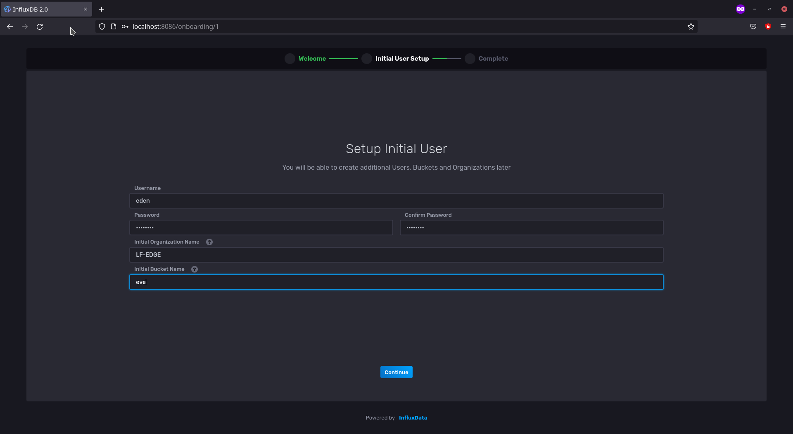
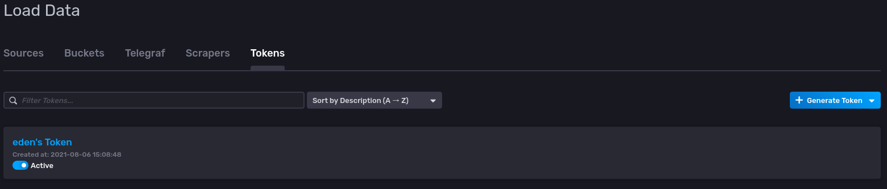
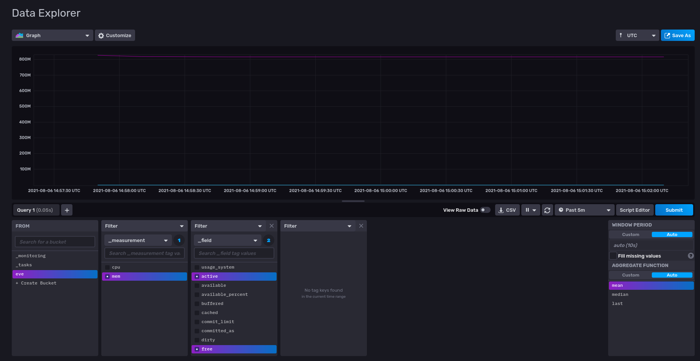

# Observing Eve's CPU and Memory Consumption via Telegraf in QEMU

In this tutorial we go through the step-by-step process of observing
an EVE device's CPU and Memory consumption in our previously generated
__QEMU Image on our Host__

## Prerequisites

Before going into this tutorial make sure to go through 
`00-Eve-Eden-Local-QEMU` post. We need to have the same setup as mentioned
in the post. In this post, we try to replace the `nginx` pod deployed as
an example with something that can provide some form of usage observability
of our EVE device, albiet in an emulated environment.

## System Architecture Design

We will use [InfluxData's InfluxDB v2](https://docs.influxdata.com/influxdb/v2.0/)
as a Time-Series Database (TSDB) to store metrics from our emulated EVE device.

Since we are in an emulated state at the moment and haven't deployed any
EVE devices (e.g. Raspberry Pis) in our network, we will consider our 
host machine as a system where:

1. Our TSDB runs and accepts information from EVE devices in the network
2. Provides a User Interface to observe the metrics

We will deploy
[InfluxData's Telegraf Monitoring Agent](https://docs.influxdata.com/telegraf/v1.19/)
as a pod on our emulated EVE device and set some configuration that will
provide us CPU usage metrics as well as memory consumption metrics.

These metrics are sent back to our TSDB where a user can observe them on a 
Dashboard and query these metrics for further analyses.

## Deployment

> __NOTE__: We will not be doing a complete secure (TLS/SSL) setup here

### InfluxDB v2.0

1. Since we already have `docker` on our host machine, let us setup the TSDB on it.

    ```bash
        $ docker run --name=influxdbV2 -p 8086:8086 influxdb:2.0.7
    ```

    This should be able to run InfluxDB v2.0.7 on the host machine and the port `8086`
    should be available for the TSDB to ingest any incoming metrics sent to it.

2. Open a browser and visit http://localhost:8086 which will provide you the UI for
    InfluxDB v2. Click on __Get Started__

3. Let's setup our InfluxDB v2 with the following information:

    _Username_: `eden`
    _Password_: `influxdb`
    _Organization_: `LF-EDGE`
    _Bucket Name_: `eve`

    
    Click __Continue__

4. Click on __Configure Later__ for the next step.
    We have now configured our InfluxDB v2 with a user `eden` under the Organization
   `LF-EDGE` and a _bucket_ called `eve` to store any metrics dedicated for it.

### Telegraf

`telegraf` requires a configuration file in TOML to be able to acquire and push
information to our TSDB. It provides a wide range of plugins but for this tutorial
we will focus on the easiest ones.

The `eden/data/telegraf/telegraf.conf` file for our case looks like the following:

```toml
[agent]
    interval = "2s"
    round_interval = true
    metric_batch_size = 1000
    metric_buffer_limit = 10000
    collection_jitter = "0s"
    flush_interval = "10s"
    flush_jitter = "0s"
    precision = ""
    debug = true
    quiet = false
    hostname = "EVE-QEMU-1" # change according to your needs
    omit_hostname = false

### INPUT PLUGINS ###
[[inputs.cpu]]

[[inputs.mem]]

### OUTPUT PLUGINS ###

[[outputs.influxdb_v2]]

  # REMEMBER TO CHANGE INPUTS HERE BEFORE DEPLOYMENT

  urls = ["http://YOUR_IP_ADDRESS:8086"]

  token = "YOUR_INFLUXDBV2_GENERATED_TOKEN_HERE"

  organization = "LF-EDGE"
  bucket = "eve"
```

Adapt the Configuration file where the `urls` should point to the host's IP Address.

For an InfluxDB v2 Token we do the following:

1. Head to __Data__ in our InfluxDB UI on the left-side column

2. We click on the __Tokens__ Header in the UI where you will see the following:

    

3. Click on `eden's Token` and copy the token into the configuration file for the
   output plugin

We are done with `telegraf` configuration! we will let `eden` download `telegraf`'s 
docker image from Docker Hub for us.


### Eden Setup

In our `eden` repository's root directory:

1. Source our environment variables for `eden`

    ```bash
    $ source ~/.eden/activate.sh
    ```

2. Start `eden`

    ```bash
    $ ./eden start
    ```

3. Let's check if our EVE device is connected to `eden` using:

    ```bash
    $ ./eden status
    ```

This should be able to provide all the necessary status checks between `eden` and `eve`

### Application Deployment

Like we previously deployed our `nginx` pod we will deploy our `telegraf` pod using:

```bash
$ ./eden pod deploy --name=eve_telegraf docker://telegraf --mount=src=./data/telegraf,dst=/etc/telegraf/
```

This should be able to start downloading the telegraf pod and begin with the deployment process:

```
INFO[0003] deploy pod eve_telegraf with docker://telegraf request sent 
```

You check that status of your pods using

```bash
$ ./eden pod ps
NAME		IMAGE			UUID					INTERNAL	EXTERNALMEMORY	STATE(ADAM)	LAST_STATE(EVE)
eve_telegraf	library/telegraf:latest	af903ac5-c464-470d-adfc-1ee75b467d03	-		-	0 B/0 B	IN_CONFIG	DOWNLOAD_STARTED (19%)
```

After a few minutes the Status should `RUNNING`

```bash
$ ./eden pod ps
NAME		IMAGE			UUID					INTERNAL	EXTERNAL	MEMORY		STATE(ADAM)	LAST_STATE(EVE)
eve_telegraf	library/telegraf:latest	af903ac5-c464-470d-adfc-1ee75b467d03	10.11.12.2	-		0 B/1.6 GB	IN_CONFIG	RUNNING
```

### Debugging and Logs

To check the logs of running pod, here `eve_telegraf` we can do the following:

```bash
$ ./eden pod logs eve_telegraf
```

If you need the logs in a different format use:

```bash
$ ./eden pod logs eve_telegraf --format=json
```

This should be able to provide you a detailed log of deployed pod's behavior

## Dashboard

Head to the InfluxDB UI and click on __Explore__ on the left-side column where you will be able to 
see `eve` bucket

Click on the `eve` bucket and select the measurements accordingly.

### Outputs

CPU Utilization of the emulated EVE device


Memory Usage of the emulated EVE device

