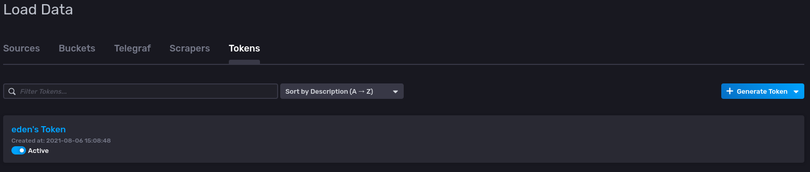

# Observe your Raspberry Pi EVE Device's CPU Usage with Telegraf and InfluxDB
This is tutorial will translate the scenario previously mentioned in 
[Observing Eve's CPU and Memory Consumption via Telegraf in QEMU - Part 2](https://github.com/shantanoo-desai/EVE-OS-tutorials/01-Eve-Eden-QEMU-telegraf.md) to an actual Raspberry Pi 4 running EVE.

## Prerequisites

If you haven't setup your Raspberry Pi 4 with EVE, please go through Part 3 first.

We assume that the setup in __Part 3__ with the Raspberry Pi 4 is up and running.

## System Architecture Design

We will use [InfluxData's InfluxDB v2](https://docs.influxdata.com/influxdb/v2.0/)
as a Time-Series Database (TSDB) to store metrics from our emulated EVE device.

Since we are in an emulated state at the moment and haven't deployed any
EVE devices (e.g. Raspberry Pis) in our network, we will consider our 
host machine as a system where:

1. Our TSDB runs and accepts information from EVE devices in the network
2. Provides a User Interface to observe the metrics

We will deploy
[InfluxData's Telegraf Monitoring Agent](https://docs.influxdata.com/telegraf/v1.19/)
as a pod on our emulated EVE device and set some configuration that will
provide us CPU usage metrics as well as memory consumption metrics.

These metrics are sent back to our TSDB where a user can observe them on a 
Dashboard and query these metrics for further analyses.

## Deployment

> __NOTE__: We will not be doing a complete secure (TLS/SSL) setup here

### InfluxDB v2.0

1. Since we already have `docker` on our host machine, let us setup the TSDB on it.

    ```bash
        $ docker run --name=influxdbV2 -p 8086:8086 influxdb:2.0.7
    ```

    This should be able to run InfluxDB v2.0.7 on the host machine and the port `8086`
    should be available for the TSDB to ingest any incoming metrics sent to it.

2. Open a browser and visit http://localhost:8086 which will provide you the UI for
    InfluxDB v2. Click on __Get Started__

3. Let's setup our InfluxDB v2 with the following information:

    _Username_: `eden`
    _Password_: `influxdb`
    _Organization_: `LF-EDGE`
    _Bucket Name_: `eve`

    
    Click __Continue__

4. Click on __Configure Later__ for the next step.
    We have now configured our InfluxDB v2 with a user `eden` under the Organization
   `LF-EDGE` and a _bucket_ called `eve` to store any metrics dedicated for it.


### Telegraf

`telegraf` requires a configuration file in TOML to be able to acquire and push
information to our TSDB. It provides a wide range of plugins but for this tutorial
we will focus on the easiest ones.

The `eden/data/telegraf/telegraf.conf` file for our case looks like the following:

```toml
[agent]
    interval = "2s"
    round_interval = true
    metric_batch_size = 1000
    metric_buffer_limit = 10000
    collection_jitter = "0s"
    flush_interval = "10s"
    flush_jitter = "0s"
    precision = ""
    debug = true
    quiet = false
    omit_hostname = false

### INPUT PLUGINS ###
[[inputs.cpu]]


### OUTPUT PLUGINS ###

[[outputs.influxdb_v2]]

  # REMEMBER TO CHANGE INPUTS HERE BEFORE DEPLOYMENT

  urls = ["http://YOUR_IP_ADDRESS:8086"]

  token = "YOUR_INFLUXDBV2_GENERATED_TOKEN_HERE"

  organization = "LF-EDGE"
  bucket = "eve"
```

Adapt the Configuration file where the `urls` should point to the host's IP Address.

For an InfluxDB v2 Token we do the following:

1. Head to __Data__ in our InfluxDB UI on the left-side column

2. We click on the __Tokens__ Header in the UI where you will see the following:

    

3. Click on `eden's Token` and copy the token into the configuration file for the
   output plugin

We are done with `telegraf` configuration! we will let `eden` download `telegraf`'s 
docker image from Docker Hub for us.


## Deployment

Deploy the telegraf Pod on the Pi using:

```bash
./eden pod deploy --name=eve_pi_telegraf docker://telegraf --mount=src=./data/telegraf,dst=/etc/telegraf/
```

Check status of the pod using:

```bash
./eden pod ps
```
After a while the pod should be deployed! let's check the status first:

```bash
./eden pod ps
NAME		    IMAGE			        UUID					              INTERNAL	EXTERNAL	MEMORY	STATE(ADAM)	LAST_STATE(EVE)
eve_pi_telegraf	library/telegraf:latest	f0e61dda-8dda-4944-85a3-4b52b736cc88	10.11.12.2	-		0 B/0 B	IN_CONFIG	RUNNING
```

Great time to head on to InfluxDB's Dashboard for some fancy graphs!

### CPU Usage Dashboard


As you can see we have a tag which matches the UUID of the Pod (see `./eden pod ps`)


### Logs and Troubleshooting

If you want to see the working logs of `telegraf`

```bash
./eden pod logs eve_pi_telegraf --fields=app --format=json
```

### Redeploy `nginx` for Fun

You can deploy the `nginx` pod from our previous tutorial as way to simulate workload on your edge device

```bash
./eden pod deploy --name=eve_pi_nginx docker://nginx -p 8027:80 --mount=src=./data/helloeve,dst=/usr/share/nginx/html
```

And you can Request the `nginx` pod like we did previously!

```bash
curl http://localhost:8027
```

After some `curl` commands consecutively you can observe the CPU System and User Usage for the EVE Device


## Clean Up

Delete the `nginx` pod:

```bash
./eden pod delete eve_pi_nginx
```

Delete the `telegraf` pod:

```bash
./eden pod delete eve_pi_telegraf
```

Stop the ephemeral InfluxDBV2 Container

```bash
docker rm InfluxDBV2
```
Stop Eden

```bash
./eden stop
```